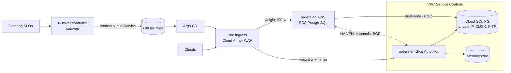

# Zero-Downtime AWS → GCP Cutover Accelerator

[](https://github.com/OWNER/zero-downtime-gcp-migration/actions/workflows/ci.yml)

A reference implementation for migrating a stateful, latency-sensitive service from AWS to GCP **with no downtime and no data loss**. It includes:

- a tested cutover engine: dual-write, checkpointed backfill, consistency verifier, and SLO-gated traffic shifting with automated rollback
- a Terraform landing zone that switches between a **lean** demo and a **full** production-grade GCP footprint with one variable
- GitOps manifests (Istio mirroring and weighted routing, Argo Rollouts with Datadog analysis, Argo CD)
- architecture decision records with a weighted GCP vs AWS vs Azure decision analysis, and an operational runbook

```
[traffic]    shadow (mirror)        PROMOTE  p99 5.2ms, errors 0.00% within SLO
[traffic]    canary-5 (5% to GCP)   PROMOTE  p99 5.5ms, errors 0.00% within SLO
[fault]      injected latency fault on gcp-cloudsql during canary-25
[traffic]    canary-25 (25% to GCP) ROLLBACK p99 125.4ms > 50.0ms
[rollback]   100% traffic back on AWS; write primary unchanged (DUAL_SOURCE_PRIMARY)
[verify]     source=5425 target=5425 missing=0 extra=0 mismatched=0 -> CONSISTENT
```

## Architecture



**The playbook:**

1. Turn on dual-write.
2. Backfill history up to the high-water mark under live load, then reconcile and verify.
3. Shadow traffic, then canary 5 → 25 → 50 → 100% of reads, gated on p99 latency and error rate.
4. Flip the write primary to GCP, with the source kept in sync for the rollback window.
5. Final verify, then decommission AWS.

Every step can be rolled back one step. The decisions are recorded in [docs/adr](docs/adr), and the go/no-go gates are in the [runbook](docs/runbook.md).

## Run it locally (no cloud, no dependencies)

```bash
python -m unittest discover -s tests -t . -v                 # 18 tests
python -m cutover.simulate                                   # full cutover
python -m cutover.simulate --inject-fault canary-25          # p99 regression -> automatic rollback
python -m cutover.simulate --inject-fault canary-5 --fault-kind errors --out out/
```

`--out` writes `report.md` and the Istio VirtualService rendered for each phase, which is exactly what the controller commits to Git.

## Deploy to GCP with Terraform

| Profile | What you get | Approx. cost |
|---|---|---|
| `lean` (default) | Private VPC, Cloud SQL PG 18 (private IP, CMEK, pgAudit), KMS, Secret Manager, Artifact Registry (CMEK), Cloud Build, and the accelerator as a **Cloud Run job** running the drill against real Cloud SQL | ~USD 1–3/day |
| `full` | Lean plus **GKE Autopilot** (private, CMEK secrets, Binary Authorization), **regional HA** Cloud SQL, **Memorystore**, Cloud NAT, **Cloud Armor** (OWASP, Log4Shell, rate limits), optional **HA VPN to AWS** and **VPC Service Controls** (dry-run, then enforce) | ~USD 15–30/day |

```bash
gcloud auth login
gcloud auth application-default login
cd infra/terraform
cp terraform.tfvars.example terraform.tfvars   # set project_id (and gcloud_bin on Windows if needed)
terraform init
terraform apply                                 # builds the image with Cloud Build and deploys
terraform output -raw run_cutover               # copy, run: cutover drill against Cloud SQL
terraform output -raw run_rollback_drill        # fault-injection drill
terraform apply -var profile=full               # optional: full landing zone
terraform destroy                               # tear down when done
```

Reports land in the CMEK-encrypted reports bucket (`terraform output reports_bucket`).

**Quality gates:** `terraform validate`, TFLint (Google ruleset), and Checkov with **76 passed / 0 failed**. The 13 Checkov suppressions are each documented inline (Autopilot-managed controls, a destroyable demo). CI also runs kubeconform against the Istio and Argo CRD schemas.

## Mapping to the role

| Requirement | Where |
|---|---|
| GCP target design for multi-cloud migration: hybrid networking, IAM, storage, security perimeters | `infra/terraform/modules/{network,security}`, [ADR-0001](docs/adr/0001-gcp-target-landing-zone.md) |
| GCP security: GKE, IAM, VPC-SC, KMS, Cloud Armor | `modules/security`, `modules/gke` |
| TOGAF-style governance, ADRs, decision analysis vs AWS/Azure | [docs/adr](docs/adr) |
| Zero-downtime cutover: shadow traffic, dual-write sync, automated rollback | `cutover/`, [ADR-0002](docs/adr/0002-dual-write-with-reconciliation.md), [ADR-0003](docs/adr/0003-slo-gated-traffic-shift.md) |
| Touchless GitOps (Argo CD), sidecar mesh (Istio) | `cutover/gitops.py`, `deploy/` |
| Datadog observability-driven releases | `deploy/k8s/base/rollout.yaml` (AnalysisTemplate) |
| Data observability: drift and lineage of migrated data | `cutover/verifier.py` |

## Layout

```
cutover/            engine: stores, dual_write, backfill, verifier, traffic, gitops, simulate
tests/              unittest suite incl. end-to-end rollback drills
infra/terraform/    landing zone + accelerator deployment (lean | full)
deploy/             Istio, Argo Rollouts, Argo CD manifests
docs/               ADRs, runbook
```

## Roadmap

- Debezium/Datastream to Kafka transport for the mirror path (replacing the synchronous secondary write)
- Kotlin/Spring Boot reference service with a transactional outbox
- AWS-side Terraform (RDS, VPN connections) for a fully automated two-cloud drill

MIT licensed.
